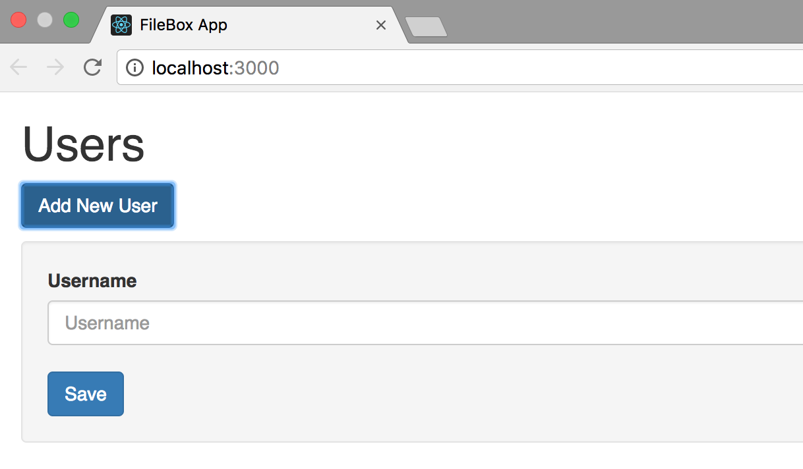
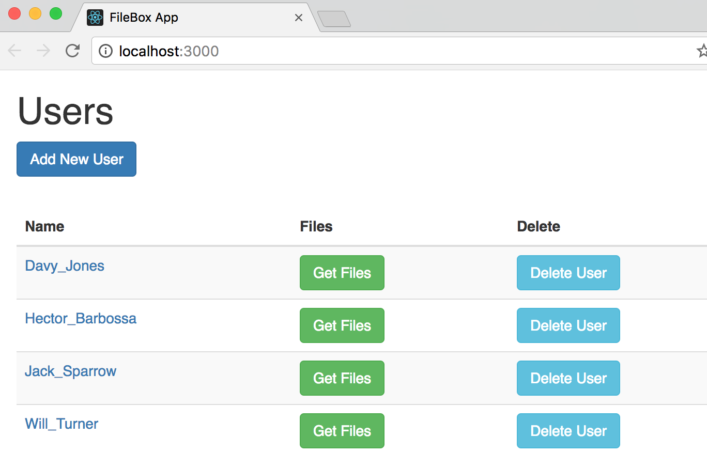
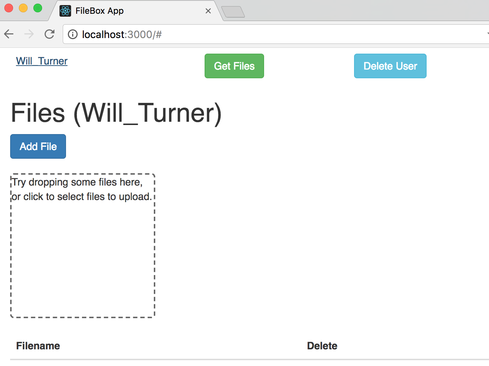
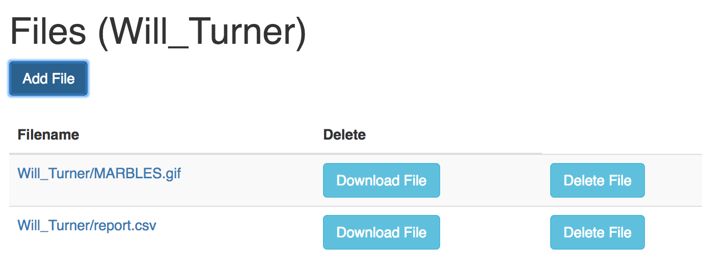

## FileBox Demo Client Application

FileBox is a demo application. This repo is the client side of the application. You can download server side project from  [server repository](https://github.com/serverside) link.

The client application is developed with React.js. The project is generated from [Facebook Create React App Configuration](https://github.com/facebook/create-react-app).

 is a spring boot project that enables managing users and files on [Amazon S3 Cloud](https://aws.amazon.com/s3/). REST services for CRUD operations on users and files are implemented.

You need [Java 8](http://www.oracle.com/technetwork/java/javase/downloads/jdk8-downloads-2133151.html) or newer version and [Maven 3](https://maven.apache.org/download.cgi) or newer version

### Technologies & Frameworks

* React.js
* Axios
* React Dropzone
* React JSX
* Babel
* Yarn

### Run the Application

You need a package manager tool like npm or yarn to run the application. I recommend yarn which is developed by facebook and is easy to use. You can install it from [yarn web site](https://yarnpkg.com/en/docs/install).

You can start the application with the following commands that run in the project path.

	$ npm start
or

	$ yarn start

### The Application

**1. Create User**
Enter a username and press save. It will cerate an object in AWS S3 like a folder.

**2. List Users, Get User Fies, Delete User**

Users are listed in the main page. You can get user files or delete a user from the list. The files added to AWS S3 are stored in the corresponding use folder.

**3.Upload A File**

The uploaded file is put in the current user folder and the file list is refreshed after adding.

**4.Delete or Download File**

